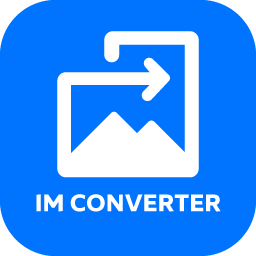

<div align="center">
  

  # IM Converter

  A clean, cross-platform desktop image converter built with Electron. Fast and reliable format conversion with minimal friction.

  [](LICENSE)
  [](#getting-started)
</div>

## About

IM Converter is a lightweight desktop app for converting images between common formats without uploading files anywhere. Drop in a batch of photos, pick an output format, and get results in seconds — all processing happens locally on your machine, including HEIC/HEIF files straight from an iPhone.

## Features

- **Drag & drop** or browse to select images
- **Batch conversion** — convert multiple files at once
- **HEIC/HEIF support** — convert iPhone photos to any format
- **Output formats** — JPG, PNG, WebP, AVIF, TIFF, GIF, BMP
- **Quality control** — adjustable slider for lossy formats (JPG, WebP, AVIF)
- **Resize** — optional width/height with aspect ratio preservation
- **Metadata** — choose to preserve or strip EXIF data
- **Dark mode** — toggle between light and dark themes
- **No overwrite** — automatically appends numbering to avoid replacing files
- **Offline** — works entirely without an internet connection

## Getting Started

### Prerequisites

- [Node.js](https://nodejs.org/) (v18 or later)

### Install

```bash
git clone https://github.com/tahakadhim00-afk/im_converter.git
cd im_converter
npm install
```

### Run

```bash
npm start
```

### Build Installer

```bash
# Windows
npm run build:win

# macOS
npm run build:mac

# Linux
npm run build:linux
```

Installers are output to the `dist/` folder.

## Tech Stack

- **Electron** — cross-platform desktop shell
- **Sharp** (libvips) — fast image processing
- **heic-convert** — HEIC/HEIF decoding for iPhone photos
- **HTML/CSS/JS** — lightweight renderer UI

## Supported Formats

| Input | Output |
|-------|--------|
| JPG, PNG, WebP, GIF, BMP, TIFF, AVIF, HEIC, HEIF, ICO, SVG | JPG, PNG, WebP, AVIF, TIFF, GIF, BMP |

## License

Distributed under the MIT License. See [LICENSE](LICENSE) for details.
